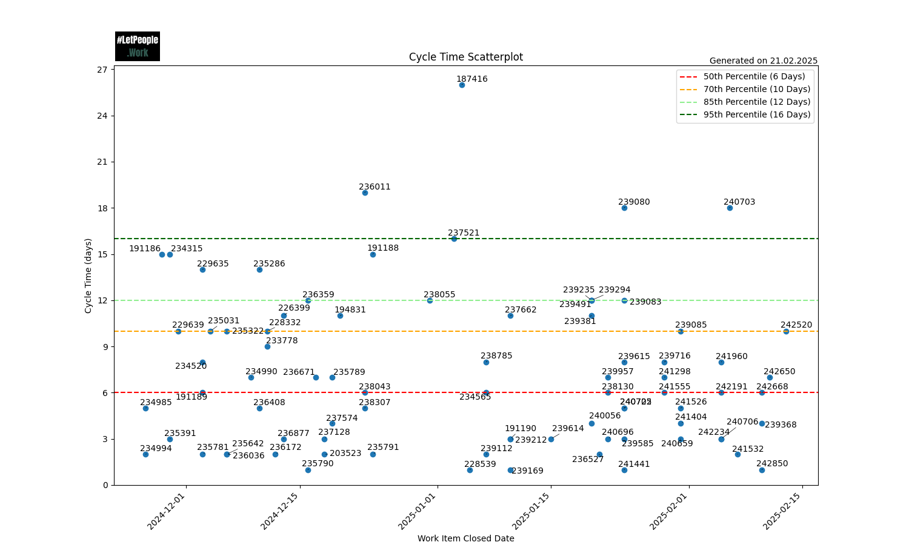
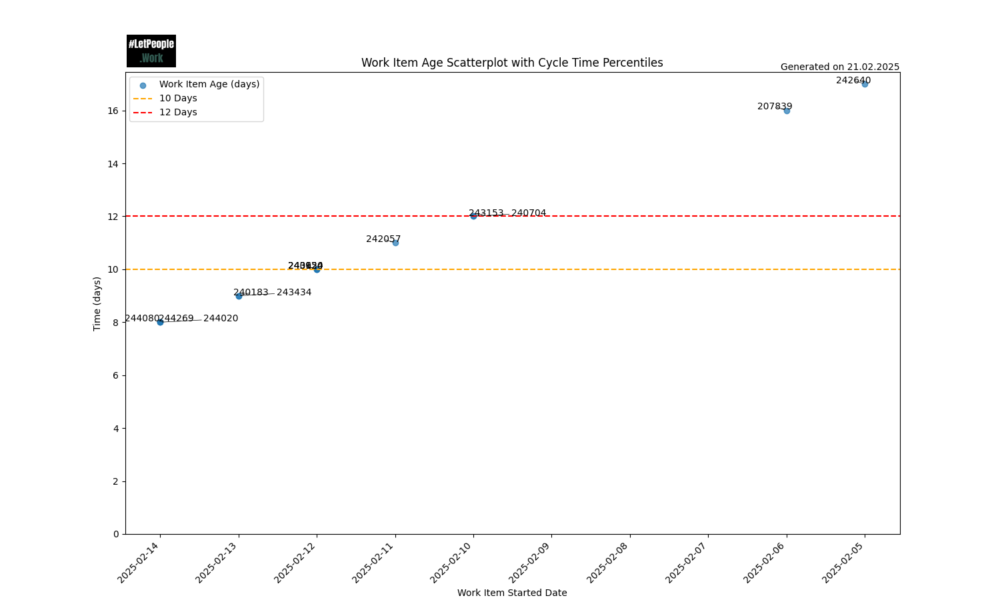
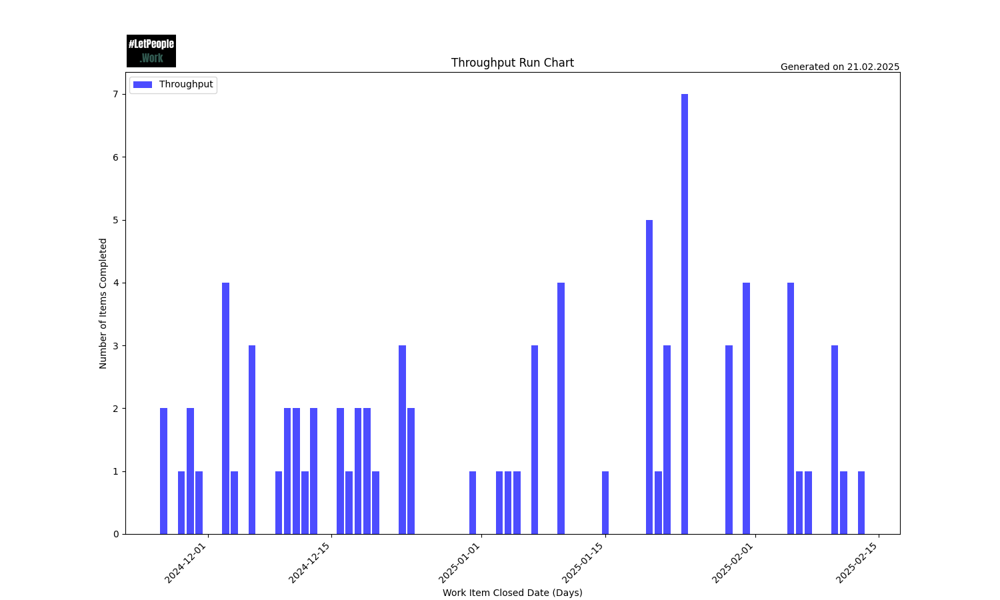
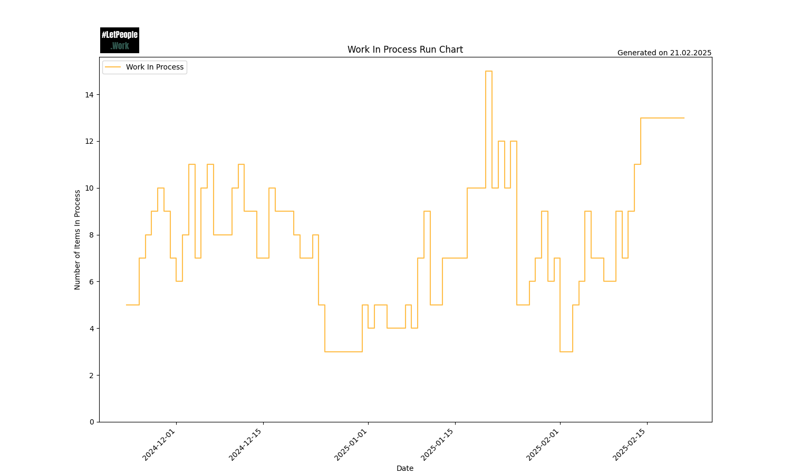
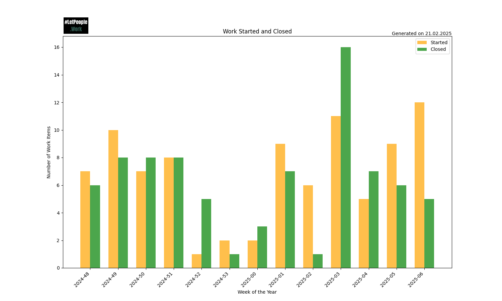
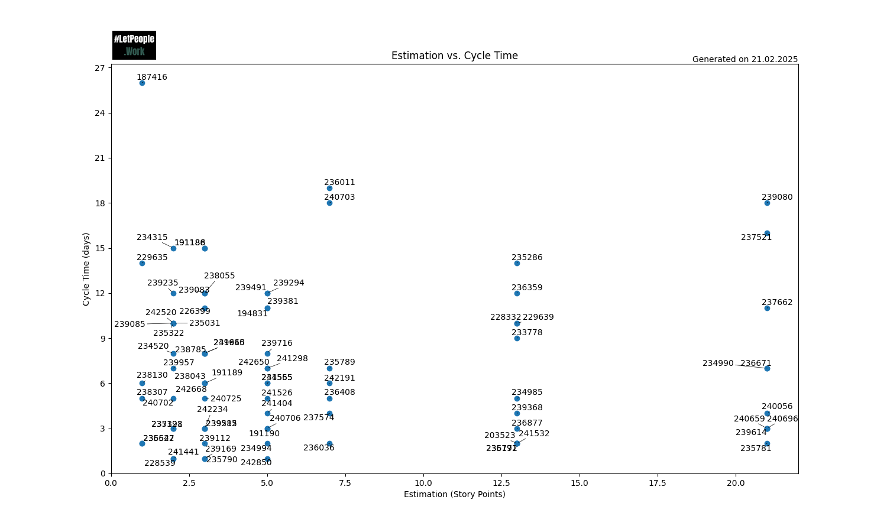
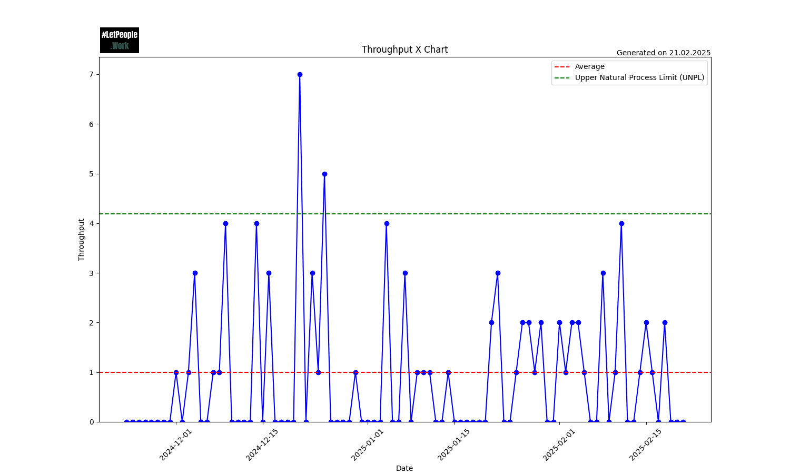
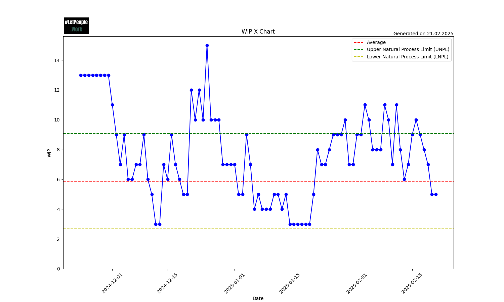
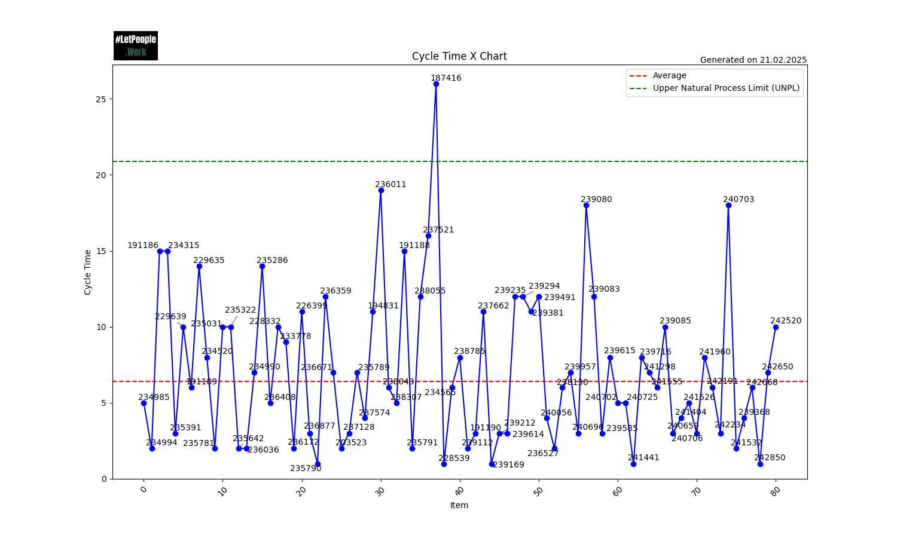
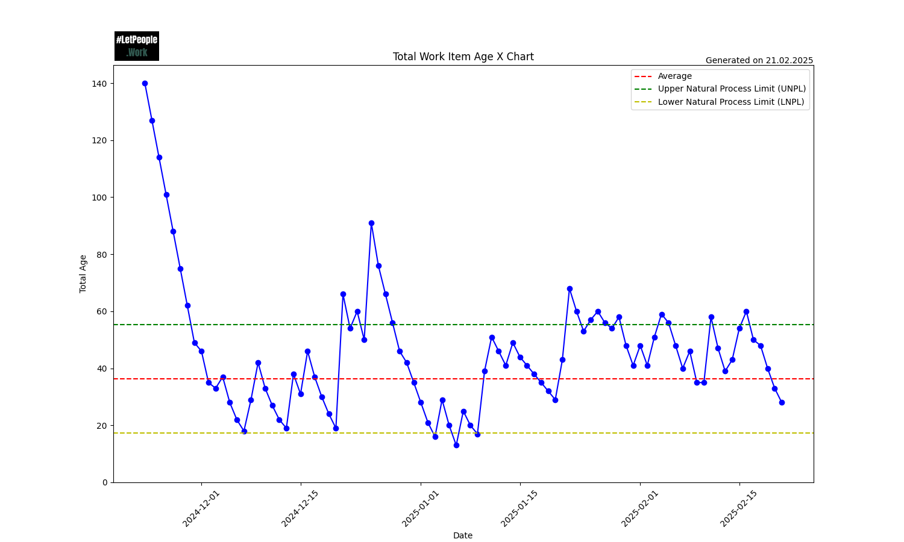

This section will show you examples of all the charts that FlowPulse can generate and explain what you are seeing and how you can use this.

{: .definition}
If you want to try out the tool with demo data, check out our [DemoConfig.json](../assets/exampledata/DemoConfig.json) and [DemoFile.csv](../assets/exampledata/DemoFile.csv). Download them, put them in the same directory, and run FlowPulse. It should generate **exactly** the same charts as you can see here.

- TOC
{:toc}

## Cycle Time Scatter Plot
This chart plots the Cycle Time for each item in the selected history. On the X-Axis you can see the *Closed Date* of each item, while the Y-Axis is the *Cycle Time* of the specific item.

The Cycle Time is calculated as follows:  
```
Cycle Time = (Closed Date - Start Date) + 1
```
The "+1" comes from the fact that we assume a Cycle Time of 1 day when an item is started and closed on the same day. That means the minimum Cycle Time is 1. Items that are not yet closed (no Closing Date) don't have a Cycle Time and will not be shown in this Chart.

The chart also includes four different percentile lines. By default 50, 70, 85, and 95, but you can configure them to your liking. They indicate how many items were closed in x days or less.



In this chart, you can see there is one outlier (*187416@25 days*). 85% of all the items were closed in 12 days or less, and 70% of all items were closed in 10 days or less.

You can use the chart to spot patterns (for example, are we closing many items on a single day, which would indicate some kind of bigger batches) or outliers (are there items that took way longer than the rest). Also, you can use the percentiles to give you guidance for Right-Sizing your work items.

In the example above, you might decide with your team that the 85th percentile might be a good target for your team. You can set your "Service Level Expectation" (SLE) to this number, so you can communicate this also with stakeholders:
> 85% of all the items will be done within 12 days or less (once they are started)

Instead of estimating time or effort (for example using Story Points), you can simply size the items by asking:
> Will we manage this in 12 days or less? 

If the answer is, you're good. If not, you might have discussions on how to achieve this or how it could be broken into smaller pieces.

## Work Item Age Scatter Plot
This chart plots the Work Item Age for each item in the selected history. On the X-Axis, you can see the *Start Date* of each item, while the Y-Axis is the *Work Item Age* of the specific item. The scatterplot can also include horizotnal lines, for example to indicate the percentiles from the Cycle Time. This is useful to spot when items are approaching our SLEs or are even already beyond them.

If items are started, but not yet finished, they won't have a Cycle Time. Instead, they have a "Work Item Age". The calculation of Work Item Age is done similar to the Cycle Time, but instead of the Closing Date, we take today's date:
```
    Work Item Age = (Today - Start Date) + 1
```

Again we use the "+1" because the minimum age is 1 day. So as soon as we start to work on an item, its age becomes 1.



In this chart, you can see that 2 items (*242640* and *207839*) are already above our *12-day* mark, while others are already approaching it.
A team should find ways to close those items first.

A way to use this chart can also be to check it out during daily meetings (if you have them) and discuss the oldest items and how progress can be made on them. If you were to use the 85th percentile as SLE, you should start discussing how to close the item once it hits the 50th percentile line.

## Throughput Run Chart
The chart shows the Throughput over the history specified. On the X-Axis you can see each *day*, while on the Y-Axis you can see how many items were *closed on this day*.

The run chart can help spot whether the team is using bigger batches to close items (for example everything gets closed at the end of a Sprint instead of continuously). The goal should be to have a steady *Throughput* with no big outliers in either direction. The more "even" this is, the more predictable your team is. This also serves as input for our [Forecasts](../forecasts/forecasts.html), if you run them. The more steady this is, the more accurate your forecasts will work.



In the above example, you can spot that there are not many periods of days where nothing was completed. As weekends are included, some "gaps" are expected. This specific period also covers end of December, which is often a very slow period where most people are off (so you can spot this gap as well).

You can see *positive* outliers, where many items were closed. While in general closing items is a good thing, you could still dig deeper on what happened then. As mentioned above, we aim for a continuous throughput, and closing 7 items on the same day might warrant some reasearch on what was happening there. For example, perhaps there was something that blocked those items to be completed earlier (perhaps a dependency on a specific individual who was on vacation, or a specific system that was down), which could be improved upon.

## Work In Process Run Chart
This chart shows the total amount of *Work In Progress* over the specified history. On the X-Axis you can see each *day*, while on the Y-Axis you can see the *WIP total* for that day. One Kanban Practice is to "Control Work In Progress" and this chart helps you to spot outliers. Are we steadily increasing or decreasing WIP? It allows us to take action if we spot this, for example by saying that we don't start anything new until we're under a certain threshold.

> An item counts to the WIP if it's started but not closed, meaning it has a Started but no *Closing Date*.



In the above example, you can see that around Christmas WIP dropped and stayed low (which makes sense given that few people were working), while in weeks after that WIP steadily increased, until a sudden drop middle of January. You remember that *positive outlier* in the [Throughput Run Chart](#throughput-run-chart)? You can see that we built up WIP until this point and then closed a lot at the same time. Definetly worth investigating what was going on at this time!

## Started vs Finished Chart
This chart shows the total amount of *items started* and *closed* per week.

One assumption of Little's Law is that *Average arrival rate equals average departure rate*. This means we should not start more than we finish (as we otherwise will continuously increase WIP). But also that we don't finish more than we start (as otherwise we eventually starve the process).

This chart helps to visualize how much we start and finish weekly. Ideally this will be in balance.



In the above example, you can see that in the beginning more was started than finished for a couple of weeks, increasing WIP. This chart helps you take action if you spot trends like those, for example by triggering a discussion on what's going on and why this might be the case. Are you batch-starting many things and closing everything at the end (as often seen with Scrum teams misusing Sprints) instead of focusing on the flow of work? This chart gives a good visual indication of such behaviour and support you and your team taking action.

## Estimation vs Cycle Time
Sometimes it can be useful to compare estimates with how long items took. In many cases this is ueseful to show that Story Points (or other estimations for that matter) won't help you a whole lot, as the the estimates and *Cycle Time* don't correlate much. We can recommend reading Nick Browns three-part blog post series: [Story Pointless](https://medium.com/nationwide-technology/story-pointless-part-1-of-3-a8fc3941691d) to learn more.



In the above chart, you can see the cycle-time on the y-axis and the estimates on the x-axis. One would assume that there is some kind of correlation, so in general, a higher estimate would mean things take longer. Reality often looks more like the example above. Actual time to complete items seems to not have any relation to the estimates. A good example of this is items that were estimated with an 8: They range from 2 days to 14 days.

Goal of this chart is to support you to make such things visible, helping people understand the waste of time estimation often is and spending the time on more meaningful things.

## Process Behaviour Charts
Process Behaviour Charts help to see how predictable your process is and whether your data shows "regular variability" or indicates a signal that should be acted up. You can read up more about PBCs in the following resources:

- [Objectively measuring "predictability"](https://medium.com/asos-techblog/objectively-measuring-predictability-469c654fdbcb)
- [Process Behaviour Charts - An Introduction](https://demingalliance.org/resources/articles/process-behaviour-charts-an-introduction)
- [Actionable Agile Metrics for Predictability: Advanced Topics](https://www.goodreads.com/book/show/209566791-actionable-agile-metrics-for-predictability)

FlowPulse allows to generate the process behaviour charts for Cycle Time, Throughput, Work in Progress, and Total Work Item Age.

Following are example charts for all four measures.









You want to look for occurrences where data points are above the upper natural process limit or below the lower natural process limit. If you operate "in between" those two lines, your process can be considered predictable.

For example if you keep your throughput in between the upper and lower natural process limit, you can expect that a Monte Carlo Simulation will provide decent results.